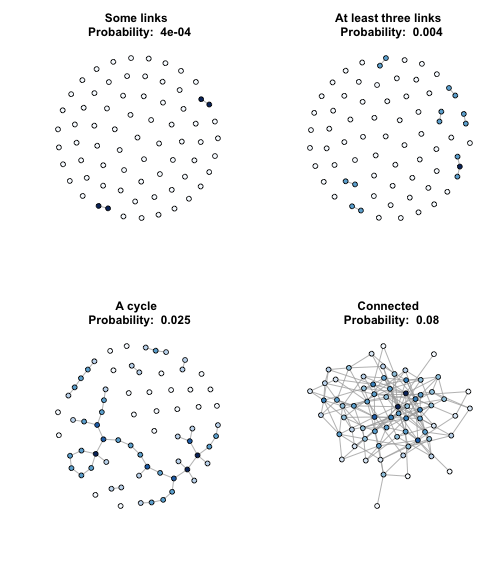
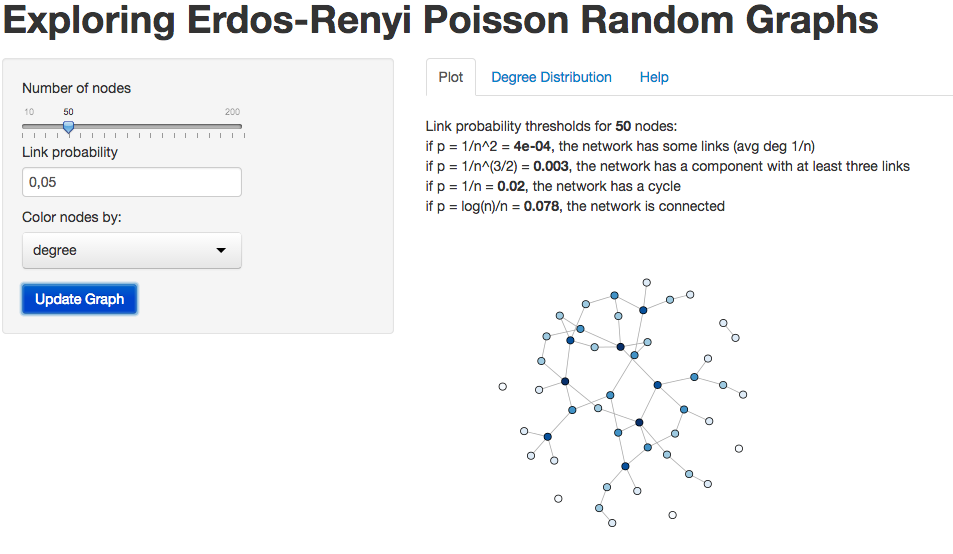

## Introduction
#### <b>What is a Random Graph</b>
<br/>
A random graph is a model network in which some specific set of parameters take 
fixed values, but the network is random in other respects. One of the simplest 
examples of a random graph is the <b>G(n,p)</b> network, studied by 
<b>Erdos-Renyi</b> during the 1960's. This graphs are generated with 2 
parameters: <b>n</b> the total number of vertices in the graph, <b>p</b> the 
probability of edges between vertices.  
In this networks the number of edges is not fixed but there are some 
values of p that suppose some important changes in the network:

- if $p = \frac{1}{n^2}$, the network has some links
- if $p = \frac{1}{n^\frac{3}{2}}$, the network has a component with at least three links
- if $p = \frac{1}{n}$, the network has a cycle
- if $p = \frac{log(n)}{n}$, the network is connected (there are no isolated nodes)

<a href="https://fperezgarcia.shinyapps.io/shinyApp/">Exploring Random Graphs</a> 
shiny app, helps you test this characteristics of 
the Erdos-Renyi G(n,p) random graphs.

--- &twocol w1:80% w2:20%
## Graph Samples, for n = 70 nodes and different values of p

*** =left
 
 

*** =right 

### R Code

```r
aGraph <- function(n, p, title){
    g <- erdos.renyi.game(n, p)
    
    if (max(degree(g)) > 0)
        dclust = cut(degree(g),9,label=F)
    else
        dclust = 1
    
    V(g)$color = brewer.pal(9,"Blues")[dclust]

    plot.igraph(g, edge.arrow.size=0, edge.curved=FALSE,
            layout = layout.fruchterman.reingold(g, niter=10000),
            vertex.label=NA, vertex.color=V(g)$color,
            vertex.size=6, main=paste(title,"\n","Probability: ",p))
}

library(igraph)
par(mfrow=c(2,2))
aGraph(70, 0.0004, "Some links")
aGraph(70, 0.004, "At least three links")
aGraph(70, 0.025, "A cycle")
aGraph(70, 0.08, "Connected")
```

--- &twocol w1:60% w2:40%
## Shiny App

*** =left
<br/>


*** =right 
<b>Left panel</b> alows you to select:
- Parameter <b>n</b> (number of nodes)
- Parameter <b>p</b> (probability of generating a link)
- Network parameter by which nodes are coloured

<b>Main Panel</b>  has three tabs:
- <b>Tab1</b>, shows a hint text with some interesting probablity values for the given 
value of n, and a plot with the resulting network
- <b>Tab2</b>, contains an histogram of nodes degree distribution
- <b>Tab3</b>, includes the application help


<a href="https://fperezgarcia.shinyapps.io/shinyApp/">Exploring Random Graphs</a>


--- &radio
## Random Graphs G(n,p) Question

Keeping the same value of p, as n gets larger, what happens with the average 
degree in the network?

1. _Average degree increases_
2. Average degree decreases

*** .hint
As n gets larger, there are more nodes in the network, therefore more nodes 
applying for generating a new link.


